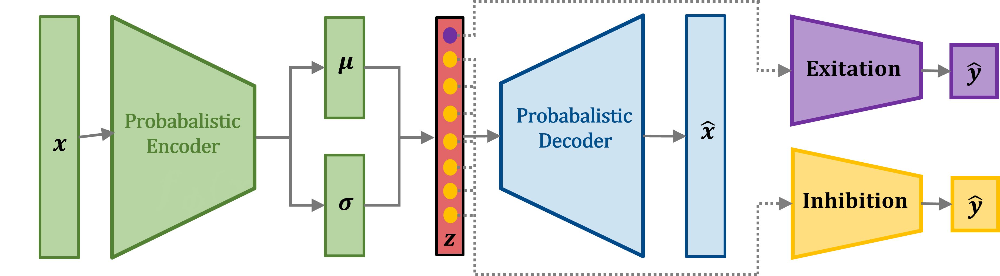

# Explaining Shape Variability:   Supervised Disentangling Variational Graph Autoencoder 

This work proposes a modular geometric deep learning framework that isolates shape variability associated with a given scalar factor (e.g., age) within a population (e.g., healthy individuals). Our approach leverages a novel graph convolution operator in a variational autoencoder to process 3D mesh data and learn a meaningful, low-dimensional shape descriptor. A supervised disentanglement strategy aligns a single component of this descriptor to the factor of interest during training. On a toy synthetic dataset and a high-resolution diffusion tensor imaging (DTI) dataset, the proposed model is better able to disentangle the learned latent space with a simulated factor and patient age, respectively, relative to other state-of-the-art methods. The relationship between age and shape estimated in the DTI analysis is consistent with existing neuroimaging literature.

  

