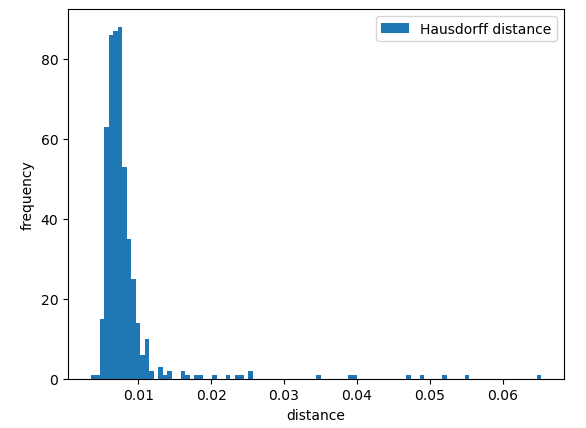

# Preprocessing

In this directory, all necessary data preprocessing steps are thoroughly explained in order to obtain 3D mesh data ready for subsequent analysis using ShapeWorks or template-based geometric deep learning approaches (i.e., SpiralNet++). 

## 1. Grooming
All data grooming steps are preformed using [ShapeWorks Python API](http://sciinstitute.github.io/ShapeWorks/notebooks/getting-started-with-notebooks.html). In order to install ShapeWorks, please follow the instructions for your platform (Windows, Mac, Linux) outlined [here](http://sciinstitute.github.io/ShapeWorks/users/install.html).

### Install requirements

```console
$ pip install --upgrade pip
$ pip install -r grooming_requirements.txt
```

### Run Script

```console
python grooming.py [args]

Options:       
    --output_dir, type=str, default='groomed_data/'
    --data_dir, type=str, default='binary_segmentations/'
```

## 2. Registration
Correspondence across all 3D mesh shpaes is accomplished using [Deformetrica](http://www.deformetrica.org/). The documentation how to use it can be found [here](https://gitlab.com/icm-institute/aramislab/deformetrica/-/wikis/home).

### Install requiremetens (local)

```console
conda install
$ conda create -n deformetrica python=3.8 numpy && source activate deformetrica

or 

pip install
$ pip install deformetrica

install requirements
$ pip install --no-index --upgrade pip
$ pip install -r registration_requirements.txt
```

### Install requirements and setup prerequisites (Compute Canada)

```console
1. Allocate GPU instance
$ salloc --gres=gpu:v100l:1 --time=0-3:0:0 --cpus-per-task=8 --mem-per-cpu=6GB

2. Load required modules

  1) CCconfig                 5) intel/2020.1.217 (t)   9) python/3.8.10    (t)    13) ucx/1.8.0
  2) gentoo/2020     (S)      6) StdEnv/2020      (S)  10) cudacore/.11.0.2 (H,t)  14) libfabric/1.10.1
  3) gcccore/.9.3.0  (H)      7) mii/1.1.2             11) cuda/11.0        (t)    15) openmpi/4.0.3    (m)
  4) imkl/2020.1.217 (math)   8) libffi/3.3            12) gdrcopy/2.1             16) cmake/3.18.4     (t)

  Where:
   S:     Module is Sticky, requires --force to unload or purge
   m:     MPI implementations 
   math:  Mathematical libraries 
   t:     Tools for development
   H:     Hidden Module


3. Create virtual environment
$ virtualenv --no-download $SLURM_TMPDIR/env

4. Activate virtual environment 
$ source $SLURM_TMPDIR/env/bin/activate

5. Install requirements
$ pip install --no-index --upgrade pip
$ pip install -r registration_requirements.txt
```

### Run Script

```console
$ python registration.py [args]

Options:    
    --data_dir, type=str, default='hippo_data/'    
    --output_dir, type=str, default='hippo_output/'
    --template_file, type=str, default='hippo_template/ab300_283_standard.vtk'
    --use_case, type=str, default='hippocampus', choices=['hippocampus', 'box', 'torus']  
```

The animation below shows the registration process for one specific example. The green shape represents the original mesh and the orange shape the reconstruction. During the optimization process, the orange tamplate shape gets morphed into the orignial shape as close as possible. 

<p align="center">
  
</p>


## 3. Evaluate Registration

The 3D mesh registration process is evaluated using the [Hausdorff distance](https://en.wikipedia.org/wiki/Hausdorff_distance) metric

$${\displaystyle d_{\mathrm {H} }(X,Y)=\max \left\lbrace \sup _{x\in X}d(x,Y) \, \sup _{y\in Y}d(X,y) \right\rbrace} \,$$

where $\sup$ represents the supremum, $\inf$ the infimum, and where $\displaystyle d(a,B)=\inf _{b\in B}d(a,b)$ quantifies the distance from a point ${\displaystyle a\in X}$ to the subset ${\displaystyle B\subseteq X}$. The figure below shows the histogram of all Hausdorff distances (i.e., original mesh and reconstructed mesh) for the hippocampus data. 

<p align="center">
  
</p>

