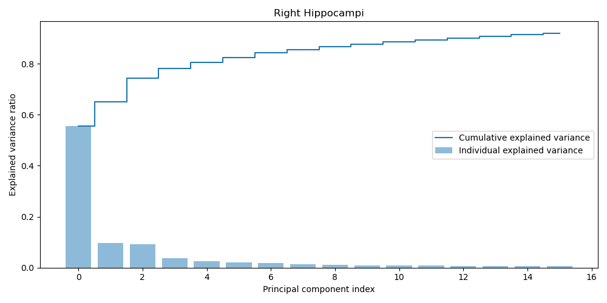

# ShapeWorks Pipeline

## 1. Run script

```console
$ python main.py [args]

Options:
    --particles, type=int, default=128
    --studio, type=bool, default=False
    --data_dir, type=str, default='data/'
    --studio_only, type=bool, default=False
    --domains_per_shape, type=int, default=2
    --project_location, type=str, default='shape_model/'
    --spreadsheet_name, type=str, default='hippocampus.xlsx'    
```

## 2. Evaluation

### 2.1 Explained variance

<p align="center">
  
   
</p>

### 2.2 Latent traversal

Given that most of the variability is explained by the first four latent variables, a latent traversal is shown based on tweaking these. 

<p align="center">
   
</p>