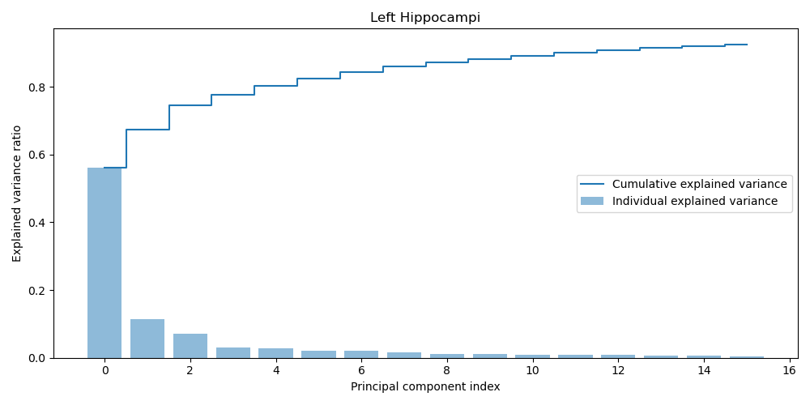

# ShapeWorks Pipeline

## 1. Run script

```console
$ python main.py [args]

Options:
    --particles, type=int, default=128
    --studio, type=bool, default=False
    --data_dir, type=str, default='data/'
    --studio_only, type=bool, default=False
    --domains_per_shape, type=int, default=2
    --project_location, type=str, default='shape_model/'
    --spreadsheet_name, type=str, default='hippocampus.xlsx'    
```

## 2. Reconstruction

### 2.1 Hausdorff distance

The plot below shows the Hausdorff distance histogram plot (i.e. distance between original mesh and reconstruced mesh) for all 511 hippocampus subjects included in the dataset. 

<p align="center">
   
</p>

### 2.2 Worst reconstruction 

Overlay plot, where the red 3D mesh represents the original mesh, whereas the gray depicts the reconstruced mesh.

<p align="center">
   
</p>

An interactive version can be found [here]("./figures/worst_reconstruction.html"). Please open this file using your preferred browser.


## 3. Principal Component Analysis (PCA)

### 3.1 Explained variance

Given that the human hippocampus consists of two seperate tissue structures, a PCA needs to be fitted for both components (i.e., left and right hippocampus) individually. As both hippocampus parts are rather similar, the explained variance from both PCA models do not differ to much (expected behaviour). 

<p align="center">
  
   
</p>

### 3.2 Latent variable traversal

Given that more than 80% of the cumulative variability is explained by the first four latent variables, a latent traversal is shown based on tweaking these. 

<p align="center">
   
</p>