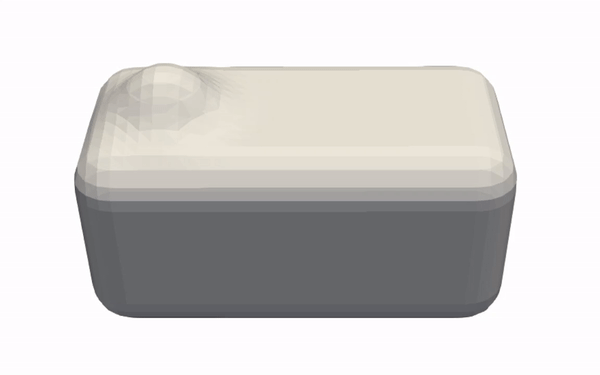
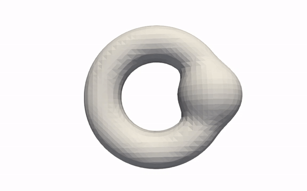

# Synthetic Data

Due to protection of data privacy, unfortunately the original hippocampus data cannot be published here. However, the synthetically generated data which we evaluate our proposed method with, can be created using the subsequent provided python script. 

## 1. Prerequisites
```console
$ pip install --upgrade pip
$ pip install -r requirements.txt
$ git clone https://github.com/fogleman/sdf.git
```

## 2. Run script

```console
$ python main.py [args]

Options:
    --dataset, type=str, default='all', choices=['all', 'box_bump', 'torus_bump'] 
```

## 3. Data preview

The tow GIFs below show what synthtic data you can expect to have at hand after running the provided python script. Both syntehtic datasets consist of 500 shapes in total. <br> <br>

<p align="center">
  
   
</p>